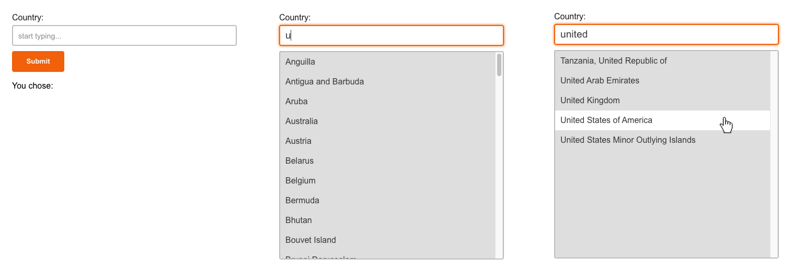

# interview-inrhythm-typeahead
This coding challenge...
- focuses on React, Redux, and TypeScript
- will have you improving a typeahead with Redux, CSS, and better UX
- is open ended with no set amount that needs to be done
- Feel free to use Google or Stack Overflow if you get stuck or forget syntax

Most of all we just want to see how you code

---

# Instructions

### Setup
1. We will grant you access to this repo
2. Clone the repo
   ```
   git clone https://github.com/inrhythm-official/interview-inrhythm-typeahead.git
   cd interview-inrhythm-typeahead
   ```
3. Run the following
   ```sh
   npm install
   npm start
   
   # If npm start doesn't work, try this instead:
   # For mac
   npm start-openssl-legacy:mac
   # For windows
   npm start-openssl-legacy:windows
   ```
4. We have already built some code for you. Try it out in your browser. Look through the files.
5. You may now start. Good luck!

---

### Part A - Redux
- Open `form-page.tsx`
- We have provided a solution using useState
- Follow the TODO comments and convert it to using Redux

---

### Part B - CSS
- Open `typeahead.css`
- Add CSS so your solution looks approximately like the following image
   

---

### Part C - Improved UX
- Open `typeahead.tsx` and `form-page.tsx`
- Propose some ideas that would improve the user-experience. We'll work on some together

---

### Part D - Extras
- If you've gotten through everything else, here's an extra section
- Tell us what else you would add or improve 
